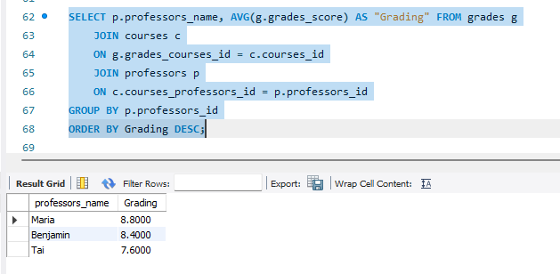
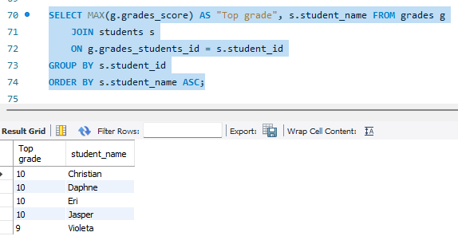
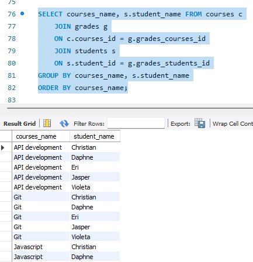
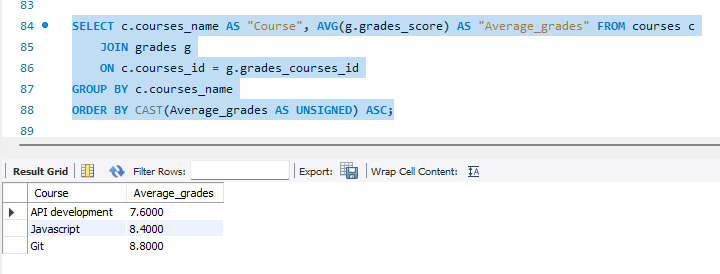
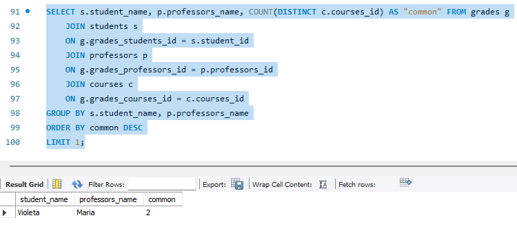
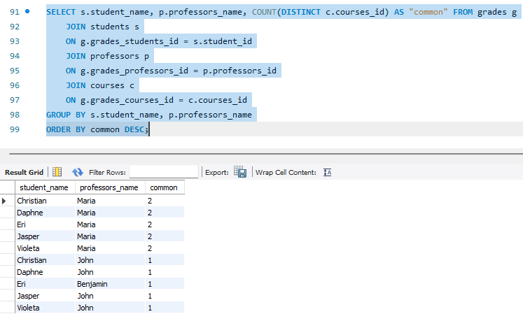

# SQL query scripts
## 1) The average grade that is given by each professor
    SELECT p.professors_name, AVG(g.grades_score) AS "Grading" FROM grades g
        JOIN courses c
        ON g.grades_courses_id = c.courses_id
        JOIN professors p
        ON c.courses_professors_id = p.professors_id
    GROUP BY p.professors_id
    ORDER BY Grading DESC;

## 2) The top grades for each student
    SELECT MAX(g.grades_score) AS "Top grade", s.student_name FROM grades g
        JOIN students s
        ON g.grades_students_id = s.student_id
    GROUP BY s.student_id
    ORDER BY s.student_name ASC;

## 3) Sort students by the courses that they are enrolled in
    SELECT courses_name, s.student_name FROM courses c
        JOIN grades g
        ON c.courses_id = g.grades_courses_id
        JOIN students s
        ON s.student_id = g.grades_students_id
    GROUP BY courses_name, s.student_name
    ORDER BY courses_name;

## 4) Create a summary report of courses and their average grades, sorted by the most challenging course (course with the lowest average grade) to the easiest course
    SELECT c.courses_name AS "Course", AVG(g.grades_score) AS "Average_grades" FROM courses c
        JOIN grades g
        ON c.courses_id = g.grades_courses_id
    GROUP BY c.courses_name
    ORDER BY CAST(Average_grades AS UNSIGNED) ASC;
    

## 5) Finding which student and professor have the most courses in common
In this example we have more than one result since the student and professor that have most courses in common is a true statement for a number of items in the database, which is why we limit the query to 1.

    SELECT s.student_name, p.professors_name, COUNT(DISTINCT c.courses_id) AS "common" FROM grades g
        JOIN students s
        ON g.grades_students_id = s.student_id
        JOIN professors p
        ON g.grades_professors_id = p.professors_id
        JOIN courses c
        ON g.grades_courses_id = c.courses_id
    GROUP BY s.student_name, p.professors_name
    ORDER BY common DESC
    LIMIT 1;

Proof that there is more than one line that meets the criteria with the sample dataset that we provided.

