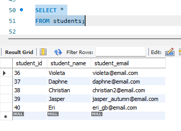
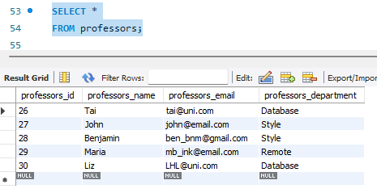
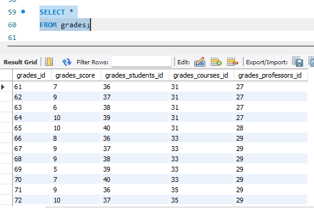
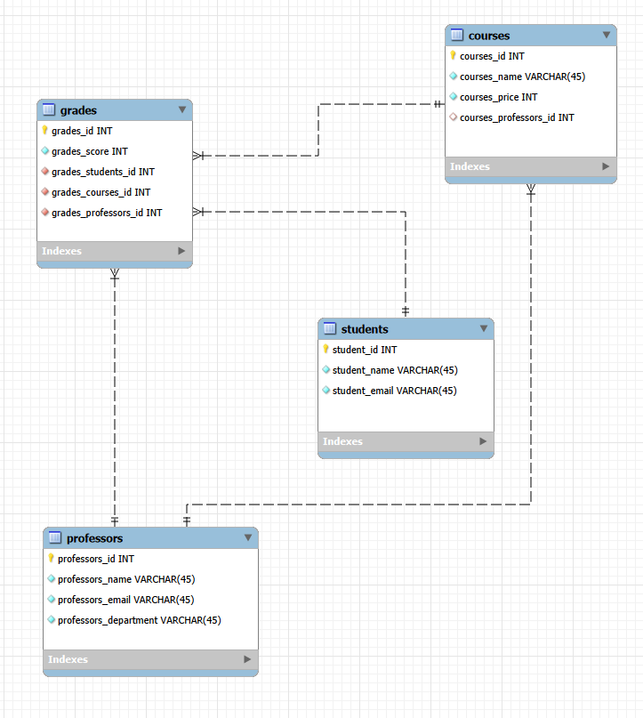

# Database with the following tables: Students, Courses, Professors, Grades

## Tables
### Student table

### Courses table

### Professors table

### Grades table

## Foreign key table relationships

## Sample data used for the project
[a link]([https://github.com/user/repo/blob/branch/other_file.md](https://github.com/VioletaSanchez/MySQL-uni-database-project/blob/main/populating_tables_with_sample_data.txt))

## SQL query scripts
[a link](https://github.com/VioletaSanchez/MySQL-uni-database-project/blob/main/MySQL%20queries.md))
